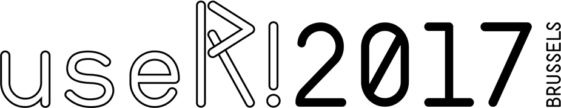

```{r, echo = FALSE}
	options(width = 150)
	library(knitr)
	knitr::opts_chunk$set(eval = TRUE, echo = FALSE)
	library(exampleReportingPackage)
```
    
## Live information

* website: https://user2017.brussels with schedule, news, info
* social networks: twitter [#useR2017](https://twitter.com/UseR_Brussels)

## UseR! conference

* ~ 1200 participants
* diverse program:
    + 16 tutorials
    + 112 talks
    + 6 concurrent lightning talk session (~10 talks/session)
    + 6 keynotes session
* social program
    + welcome reception
    + poster session
    + conference dinner

## Preparation

* plan session attendance in advance:
    + website
    + useR!2017 schedule app:  
    [iOS
      App store](https://itunes.apple.com/WebObjects/MZStore.woa/wa/viewSoftware?id=1246681655&mt=8)
  or [Google Play
  Store](https://play.google.com/store/apps/details?id=org.sched.user2017)
    + brochure
    + possibility to provide picture
* 'clear your schedule'

## Tips

* tutorials: check presenter guidelines
* multiple concurrent sessions:
     + can leave/change session (discreetly)
* ask for help: 
    + crew
    + info point

## Sponsors

* visit sponsor area:
    + goodies
    + live contact
    + career opportunities 
     
## Meeting opportunity

* dare to approach attendees/speakers during conference
     + ask questions during/after presentations, during breaks
     + poster session: less formal
* move out of your comfort zone
* skip sessions for networking
     
## Take it back home

* take notes: presenter, topic(s), new ideas/packages
* share conference insights with colleagues
* slides/videos available after conference

## In practice

* dress comfortably
* enjoy beer with moderation

## Bonus: Brussels, 'center' of Europe {.centered .smaller}

<center>
```{r mapUseR}

	library(leaflet)
	iconsMap <- iconList(
		useR = makeIcon("./images/useR2017_logo.png", 
			iconWidth = 250, iconHeight = 60)
	)
	leaflet(width = 600, height = 400, padding = 10) %>% 
		addProviderTiles(provider = "OpenStreetMap.France") %>% 
		setView(lng = 4.321240, lat = 50.822312, zoom = 12) %>% 
		addMarkers(lng = 4.321240, lat = 50.822312, 
			icon = iconsMap["useR"],
			label = "UseR 2017: Wild Gallery")
	
```
</center>

<span style="font-size:0.5em;">

* Flanders: http://www.visitflanders.com/
* Wallonia: http://www.belgium-tourism.be/
* Belgium cities: [Brussels](https://visit.brussels/en),
  [Antwerp](http://www.visitantwerpen.be/en),
  [Ghent](https://visit.gent.be/en/home), [Liège](http://www.liege.be/tourisme)
  
</span>  

## {.centered}

<span style="font-size:3em;">**Enjoy** </span>
 
<br>

  

